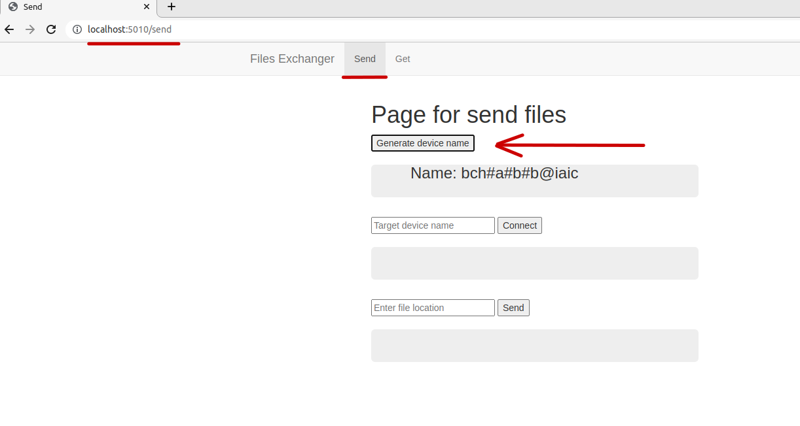
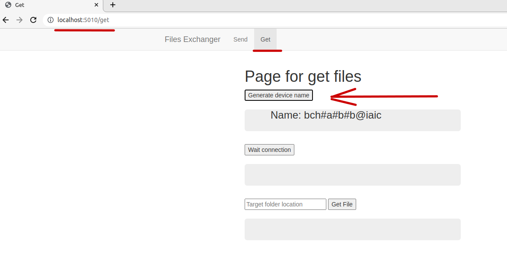
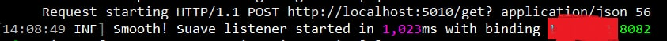
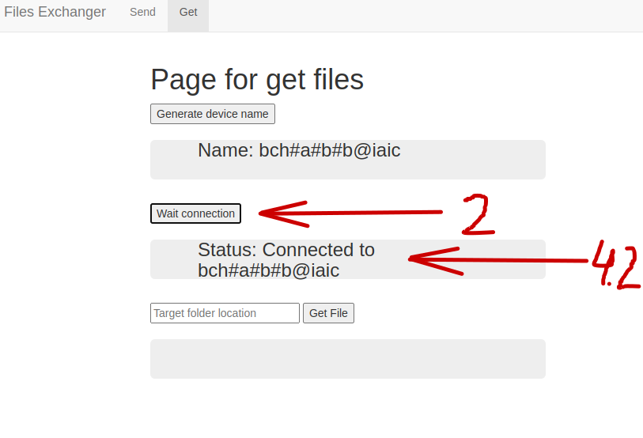
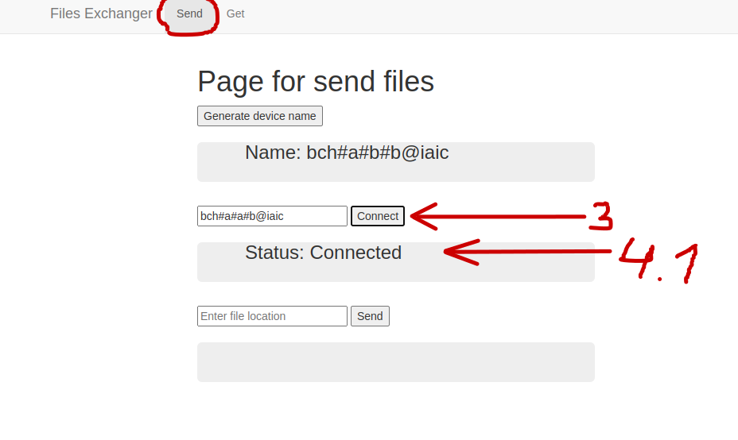
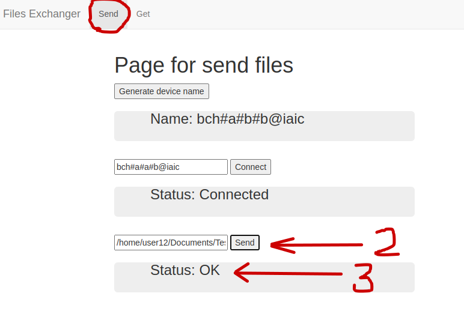
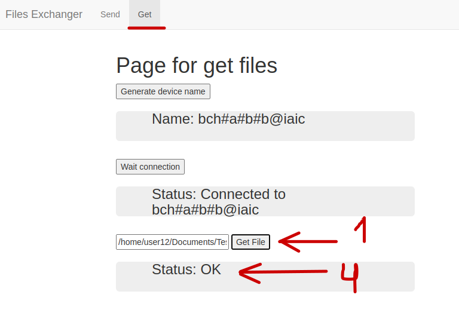

# Files Exchanger

## I. Disclaimer
```
The author is not responsible for the use of this project and code. It is just
an educational/experimental project for my F# course.
```

## II. Description
```
    Current project was and experimental project with F# language. It helps 
people to exchange files in local network, without using popular messangers.
    Sometimes, program can work too long with big files. So, it is recommenteds
to use current program, only with really small .txt files.
```

## III. How to run
```
    You can find executable .zip files in folder "common" (for windows-x64, linux-x64), and run them in console as in example
(But you have to run it in current folder, which you extract from .zip files, otherwise you will get an error)
```


## IV. Example of exchanging files
User1 - have to send file<br/>
User2 - have to get file

### Step 1 (open the page and generate device name)
```
    User1 should open the page http://localhost:5010/send and press 
button "GenerateDeviceName", for generation personal "UserDeviceName_1" in local network.
```


### Step 2 (open the page and generate device name)
```
    User2 have to open the page "http://localhost:5010/get" and press 
button "GenerateDeviceName", for generation personal "UserDeviceName_2" in local network.
```


### Step 3 (first connection)
```
1. User2 have to give to the User1 of his "UserDeviceName2". 
2. User2 press button: "Wait connection"
```
User2 have to wait a log in console, as on the picture:

```
3. User1 put UserDeviceName2 into label and press button "Connect"
4. 
    4.1. User1 get the message: "Status: Connected"
    4.2. User2 get the meccage: "Status: Connected"
```



### Step 4
```
1. User2 print the target folder for file from User1,  and press button "Get file"
```
User2 have to wait a log in console as in picture:

```
2. User1 print the location of file, which he want to send and then press button "Send"
3. User1 get message: "Status: OK"
4. User2 get message "Status: OK"
```



# Profit!

## V. Plans for future
```
- improve compression algorythm (make it faster)
- improve crypto algorythm (add new)
- add button "Choose file"
```


## VI. Short description, how it works inside

### Used tools
```
- Websharper for UI
- Haffman algorythm for compression data
- RSA algorythm for encryption data
- Suave server for receiving of client messages
```

### Sending process
```
1. Data encrypted by RSA algorythm
2. Data compressed by Haffman algorythm
3. Program opens websocket on special port for send file
```

### Getting process
```
1. Program run Suave server for get new data
2. When program get new data, current data decompressed by Haffman tree
3. Then current data decrypted by RSA algorythm
```

## VII. Unexpected troubles/errors
```
    If you get some unexpected error: try to restart program.
```